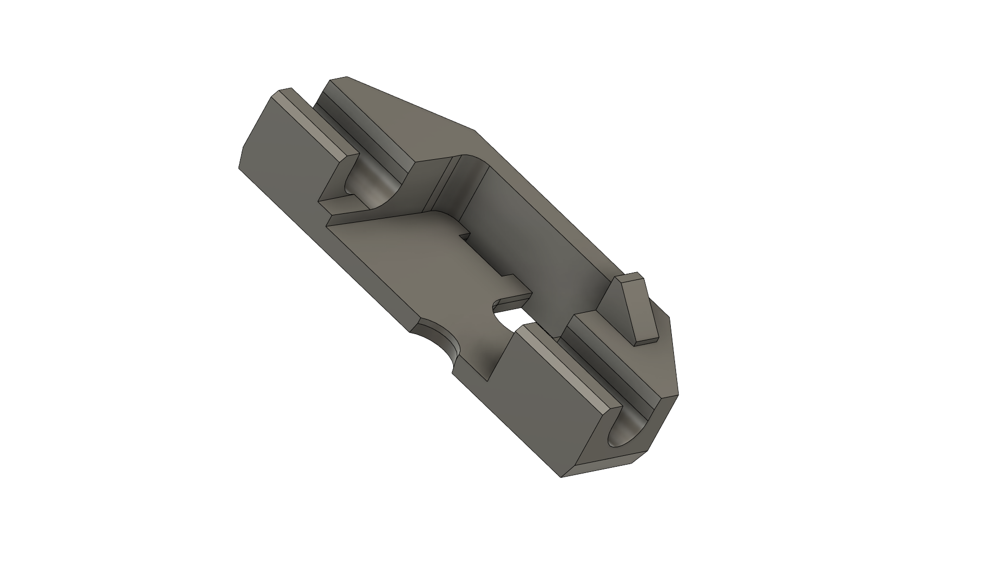
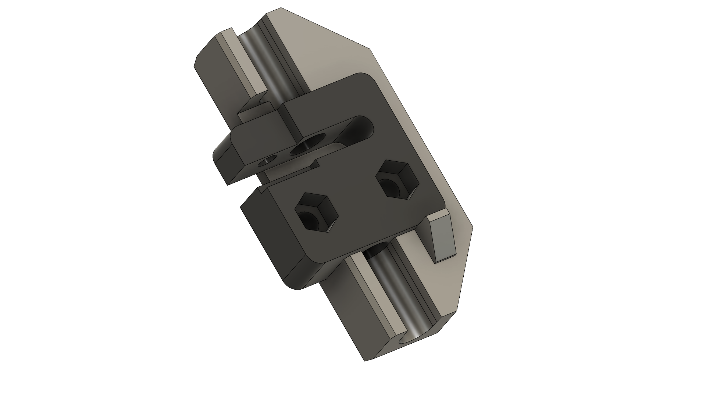
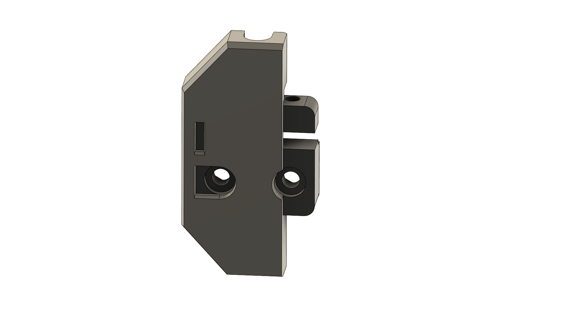
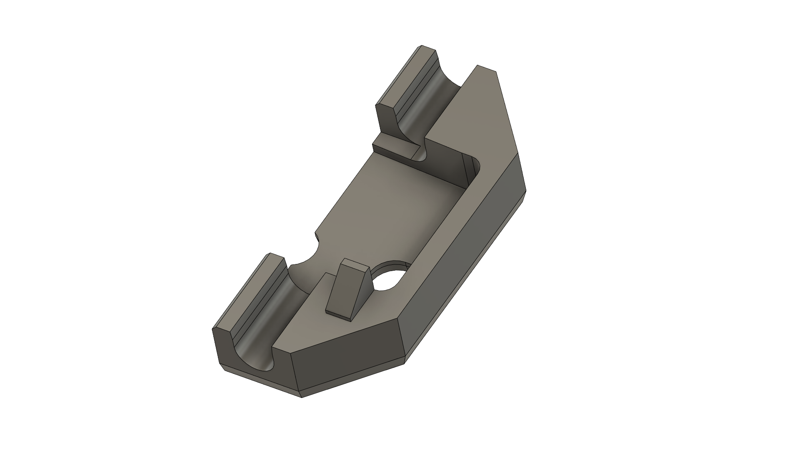
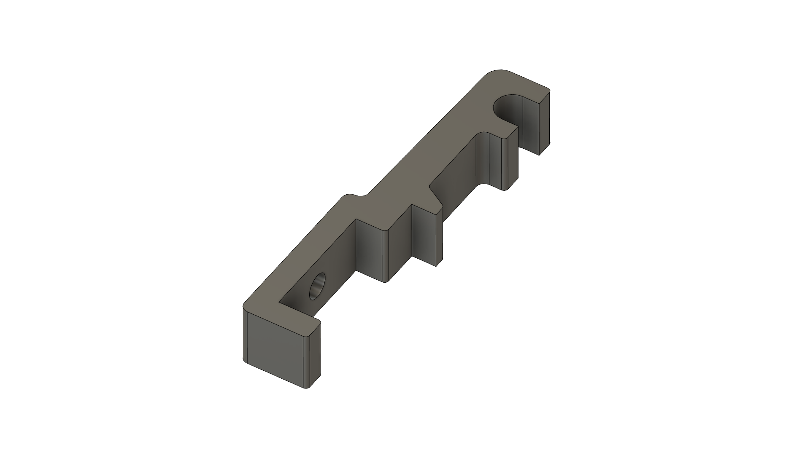
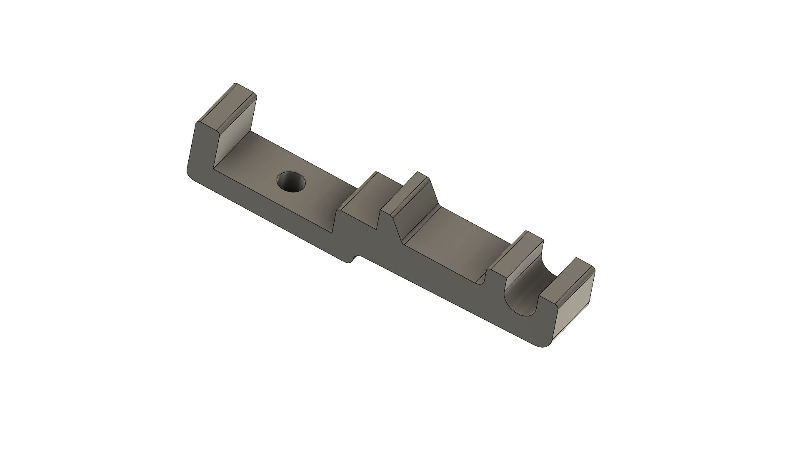

# V-Minion Z Rod Alignment

**BETA NOTICE - Its tested but still beta - some changes might happen and please provide feedback as Github Issues :-)**

1. Move the X Gantry to 90mm
2. Unscrew release the motor screws (4 screws)
3. Remove the wire relief on the X Gantry + the spool holder
4. Unscrew the Nut block
5. Put on the nut Z RodJigV3
6. Put on 2 of the AligmentV3 mounts on the side - with 2x M6 + TNut
7. Untighten the Z Linear rail and make sure its flush to the AlignentV3 bracket and tighten the Z Linear rail again
8. Align the motor / nutblock and make sure its aligned in the alignment brackets and the motor is not constrained
9. Tighten the nut + motor, and remove the alignement tools
10. Put back wire relief and spool holder

## Files - Printing

Print with 3-4 walls and 25% infill

* 1x - [ZRodJigV3.stl](ZRodJigV3.stl)
* 2x - [AlignmentV3.stl](AlignmentV3.stl)

## Showoff

### Backlash jig

### Rod alignment

